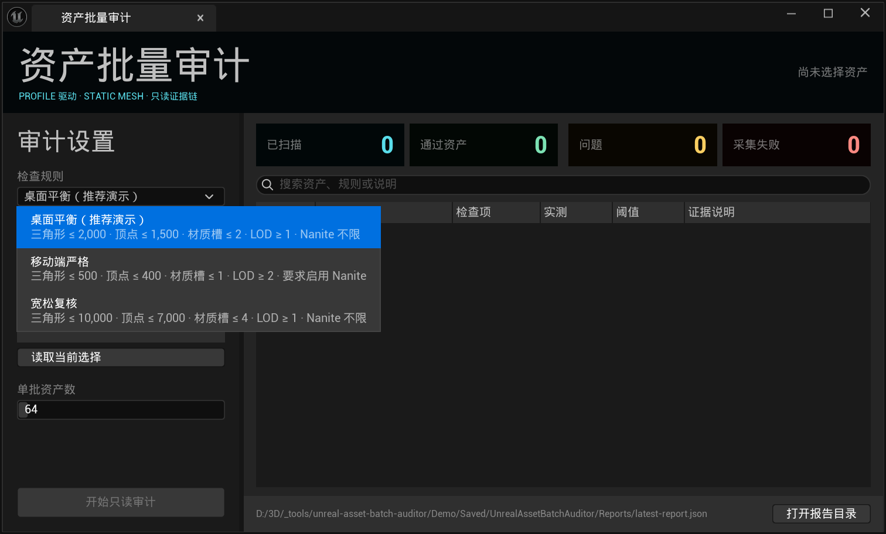
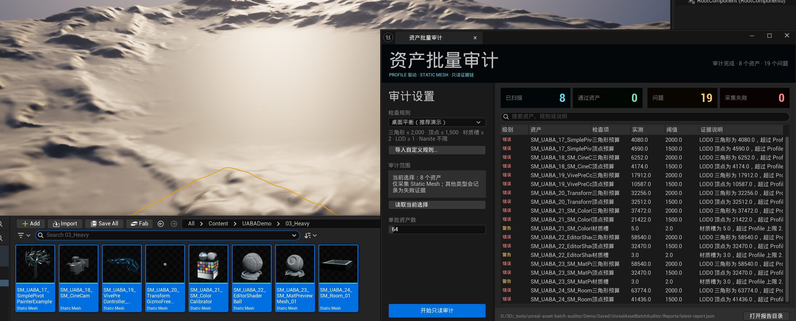
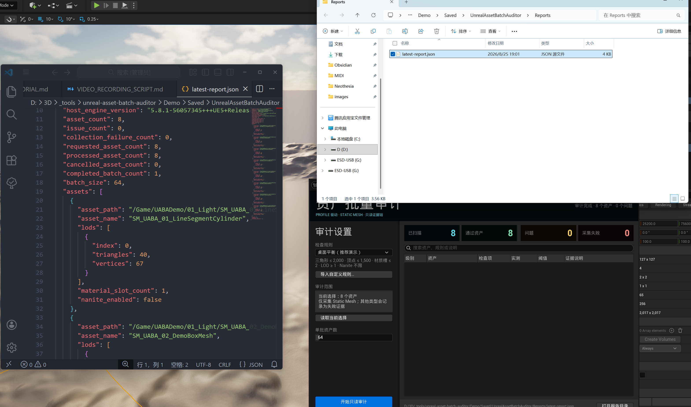

# Unreal Asset Batch Auditor

面向 Unreal 项目 Static Mesh 的只读批量审计工作台。项目 Profile 定义预算和预期，Editor-only C++ 模块批量采集元数据，Python 负责规则编排与 JSON 报告。扫描接口不保存资产、不重建网格，也不修改 Nanite。

## 三步完成资产审计

### 1. 选择项目检查规则

从插件内置的规则下拉框选择审计 Profile，界面直接展示三角形、顶点、材质槽、LOD 与 Nanite 阈值。普通用户无需接触 JSON 路径；项目可以通过“导入自定义规则”接入自己的标准。



### 2. 选择资源并执行批量审计

在 Content Browser 中选择资产，读取当前选择后执行只读审计。下图使用“桌面平衡”规则检查 8 个 Heavy Static Mesh，得到 19 条问题；每条结果都显示资产、检查项、实测值、阈值和证据说明。



### 3. 查看可追溯报告

面板汇总通过、问题与采集失败数量，并把本次运行写入版本化 JSON Report。报告保留宿主版本、资产元数据、Issue、Evidence、Profile 阈值和批次统计，可用于复核、自动化或后续质量门禁。



以上截图来自 UE 5.8.1 中的真实插件运行与仓库 Demo 资产。演示 Profile 使用模拟项目阈值，仅用于说明规则驱动流程，不代表行业统一标准。

## 当前已实现

- 版本化 JSON `Profile`、`Issue`、`Evidence`、`Report` 合同；
- LOD0 三角形预算、LOD0 顶点预算、材质槽上限、LOD 数量下限、Nanite 预期状态；
- 每条 Evidence 记录观测值、Profile 期望值及其 JSON Pointer；
- Report 同时保存所有成功资产的采集元数据，因此通过项也可与 Editor 复核；
- Unreal Editor-only 插件和只读 C++ 批量采集接口；
- UE 原生中文 Slate 面板：读取 Content Browser 选择、从预置规则下拉框切换 Profile、运行审计与共享搜索；
- “资产总览”展示每个已采集资产的通过/需处理/失败状态、LOD0 三角形、顶点、材质槽、LOD、Nanite 和问题数，不再隐藏通过资产；
- “问题明细”保留严重度、规则、实测值、Profile 阈值与本地化证据说明，并可直接打开最新 JSON 或报告目录；
- 调用方可设置正整数批次大小；进度事件覆盖请求、处理、成功、失败和取消数量；
- 取消仅在 C++ 批次之间生效，已完成批次的资产与失败证据会保留在 Report；
- Python fixture collector 与 Unreal C++ collector 使用同一编排边界；
- 离线错误资产集、回归测试和显式 `real_unreal_validation=false` 报告。

示例 Profile 的数值只是格式示例，不代表行业标准。正式项目必须复制并评审自己的 Profile。

## 离线运行

```powershell
python -m venv .venv
.\.venv\Scripts\python.exe -m pip install -e ".[dev]"
.\scripts\validate.ps1 -Tier quick
.\.venv\Scripts\unreal-asset-audit.exe `
  --profile config\Profiles\default-static-mesh-profile.v1.json `
  --fixture tests\fixtures\static_meshes.v1.json `
  --out artifacts\reports\offline-fixture-report.json
```

离线 fixture 只验证合同、规则和报告编排，不能证明插件已经在 Unreal 中编译或运行。

## 可录制 Demo Kit

仓库内置一个 UE 5.8.1 非生产演示工程和确定性生成脚本。脚本从用户本机已安装的 `/Engine`
内容生成 24 个真实项目 `.uasset`，并建立三种复杂度分组、三套训练 Profile、两个诊断输入、
真实报告与只读哈希证据。

```powershell
.\scripts\prepare_demo.ps1 -EngineRoot "C:\Program Files\Epic Games\UE_5.8"
```

- [完整安装与操作教程](docs/demo/DEMO_SETUP_AND_USE.md)
- [24 个演示资产矩阵](docs/demo/DEMO_ASSET_MATRIX.md)
- [6–8 分钟录屏分镜与讲稿](docs/demo/VIDEO_RECORDING_SCRIPT.md)
- [8 张真实界面截图清单](docs/demo/SCREENSHOT_PLAN.md)

Demo Profile 是为了形成清晰对比而模拟的项目数据，不代表行业标准。主要 Editor 交互入口是
`工具 > 资产批量审计`；脚本入口仍保留给自动化、回归测试和进阶演示。

仓库不再分发由 Unreal Engine 内容复制出的 `.uasset` 二进制；`prepare_demo.ps1` 会在本机生成它们。
生成器不会修改 `/Engine` 原始资产。

插件安装包自带三套可直接选择的演示规则：`桌面平衡（推荐演示）`、`移动端严格`、`宽松复核`。
普通用户不需要填写 JSON 路径；“导入自定义规则”只用于项目接入自己的 Profile。

## Unreal 安装与编译

1. 把本仓复制或链接到 `<Project>/Plugins/UnrealAssetBatchAuditor`。
2. 在项目 `.uproject` 中启用 `PythonScriptPlugin`，并启用本插件。
3. Python 编排包已位于插件标准目录 `Content/Python`，不需要额外复制或配置搜索路径。
4. 关闭 Editor，重新生成 IDE project files。
5. 用项目所对应的 Unreal Engine 版本构建 `Development Editor` target。
6. 启动 Editor，在 `工具 > 资产批量审计` 打开工作台，再按
   [宿主测试清单](docs/HOST_TEST_PLAN.md)执行真实验证。

插件 descriptor 只声明 `Editor` 模块。C++ collector 仅接收显式 object path，并读取
`UStaticMesh` render data、材质槽和 Nanite 设置。当前实现为了获得顶点/三角形数据会加载指定网格；没有扫描整个项目，也没有逐顶点 Python 循环。

Editor Python 的便捷入口默认每批 128 个显式 object path，也允许调用方注入取消和进度回调：

```python
from run_asset_audit import run

report = run(
    profile_path="D:/Project/Config/static-mesh-profile.json",
    asset_paths=selected_asset_paths,
    output_path="D:/Project/Saved/Audits/static-mesh-report.json",
    batch_size=64,
)
```

## 验证边界与下一阶段

- 当前没有自动修改 Nanite、SavePackage、MarkPackageDirty 或网格 Build API；
- 已在 UE 5.8.1（changelist 56057345）完成 Win64 Development Editor BuildPlugin、命令行真实宿主运行和可见 Static Mesh Editor 复核；
- Cube 与 Sphere 的三角形、顶点、材质槽、LOD、Nanite 状态与真实报告一致；错误路径作为单资产失败返回；
- 扫描前后 Engine BasicShapes 的 9 个 `.uasset` SHA-256 全部不变；证据位于 `artifacts/host-validation/`；
- 已建立 64 个 Engine Static Mesh、2 次预热、7 次重复的真实宿主热缓存基线；结果只用于回归，不外推到生产项目或数千资产；
- 有界分批、进度、批次间取消和部分失败汇总已在真实 UE 5.8.1 宿主验证；完整场景调用尺寸为 `[2,2,1]`，取消场景只执行首批 `[2]`；
- M4 产品化切片已完成资产总览/问题明细代码与 UE 5.8.1 BuildPlugin；新的可见面板截图仍需在独立 Editor 会话中刷新，旧截图不冒充新界面证据；
- M5 将扩展碰撞、Lightmap UV、命名和目录政策，所有阈值继续来自版本化 Profile；
- M6–M7 继续处理大批量交互、保存会话、团队交接、发布包与完整视觉证据，不为了复杂度强行加入 AI/PCG。

持续开发状态见 [`config/goal-state.json`](config/goal-state.json)，可恢复的 Codex `/goal` 提示词见
[`docs/development/CODEX_PRODUCTIZATION_GOAL.md`](docs/development/CODEX_PRODUCTIZATION_GOAL.md)，完整路线见
[`docs/DEVELOPMENT_PLAN.md`](docs/DEVELOPMENT_PLAN.md)。
