# Unreal Asset Batch Auditor

面向 Unreal 项目 Static Mesh 的只读交付验收台。项目 Profile 定义预算和预期，Editor-only C++ 模块批量采集元数据，Python 负责规则编排与 JSON 报告。扫描接口不保存资产、不重建网格，也不修改 Nanite。

> **当前源码：v0.9.0-dev3** · 已通过 UE 5.8.1 BuildPlugin 与独立宿主验证<br>
> **公开可安装版本：v0.8.0 Beta** · Windows 11 / Unreal Engine 5.8.1 已验证<br>
> [下载已编译插件](https://github.com/Ubik42/unreal-asset-batch-auditor/releases/tag/v0.8.0) ·
> [5 分钟安装说明](docs/RELEASE_INSTALL.md) · [完整录屏脚本](docs/demo/VIDEO_RECORDING_SCRIPT.md)

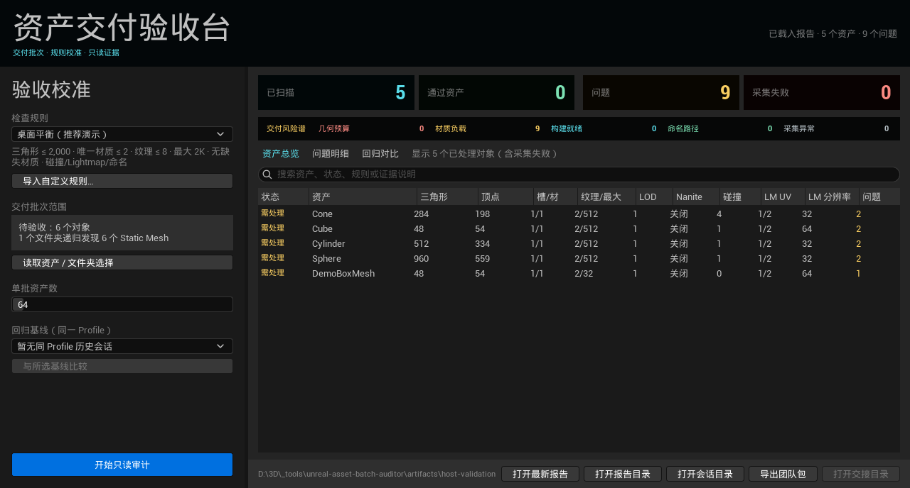

<p align="center"><sub>真实 UE 5.8.1 原生 Slate：左侧校准规则和交付批次，顶部风险谱按真实 Report 汇总问题，主表保留完整资产证据。</sub></p>

## 这个项目体现什么

- **真实管线分层**：C++ 批量读取 Unreal 原生元数据，Python 负责项目规则、任务编排和报告，UI 不承载隐藏业务判断；
- **上下文与证据设计**：Profile、Issue、Evidence、Report 均有版本化合同，每个问题都能追到实测值、期望值和规则指针；
- **生产可靠性**：逐批任务、批次间取消、部分失败隔离、不可变会话和修复前后回归，不把“没有抛异常”当作成功；
- **团队交付**：一键生成中文 HTML、Excel 可读 CSV 和 SHA-256 清单，无 Unreal 环境也能参与复核；
- **面板与门禁同源**：项目预设把 Profile、显式目录和阻断等级固化为可评审 JSON；人工验收和命令行门禁消费同一规则源；
- **可安装而非只在开发机运行**：发布 ZIP 经过确定性打包、全新项目安装、升级、卸载和两轮独立 UE 宿主验证。

## 三步完成资产审计

### 1. 选择项目检查规则

从插件内置的规则下拉框选择审计 Profile，界面直接展示三角形、顶点、材质、纹理依赖、最大纹理尺寸、
LOD、Nanite、碰撞与 Lightmap 阈值。普通用户无需接触 JSON 路径；项目可以通过“导入自定义规则”接入自己的标准。

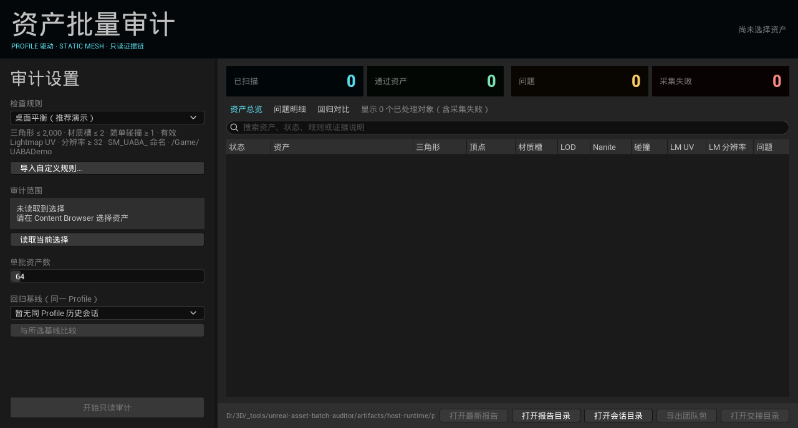

### 2. 选择资源并执行批量审计

在 Content Browser 中显式选择多个资产，或选择一个/多个文件夹。插件会递归发现文件夹内的 Static Mesh，
与单独选择的对象合并、去重并稳定排序；不会默认扫描整个项目。资产总览不会隐藏通过项，同一批次内
可以直接对比通过、需处理和采集失败对象。


### 3. 查看可追溯报告

切换“问题明细”即可看到严重度、规则、实测值、Profile 阈值和中文证据说明。面板把本次运行写入版本化 JSON Report，保留宿主版本、资产元数据、Issue、Evidence 与批次统计。

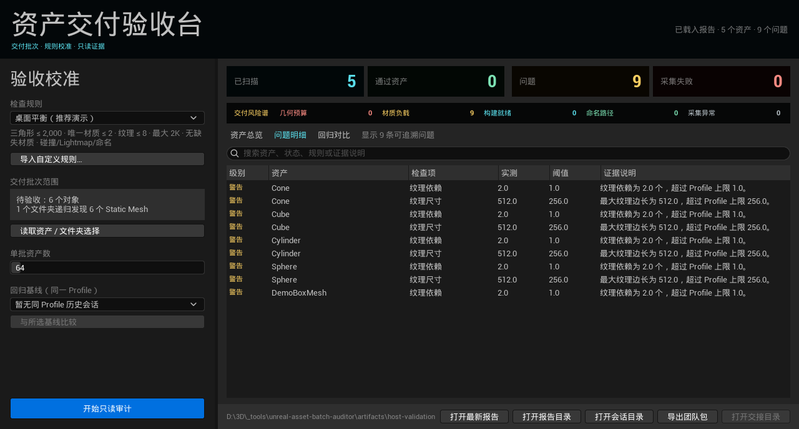

以上 v0.9-dev2 面板截图由独立 UE 5.8.1 `-RenderOffscreen` 宿主直接渲染生产 Slate 控件，数据来自真实
Engine Static Mesh；不是网页复刻或设计稿。完整演示流程另使用 24 个本机生成的项目 Demo `.uasset`。生命周期记录保存测试 PID、
耗时、退出状态、截图、报告与交接包哈希。自动化证明面板渲染、任务状态、批次间取消和报告解析，
不冒充鼠标点击人工测试。演示 Profile 使用模拟项目阈值，不代表行业统一标准。

## 真实状态画廊

### 材质与纹理风险

资产台账用“槽/材”和“纹理/最大”同时表达材质槽、唯一有效材质、已加载纹理依赖数与最大边长。
风险谱可只查看材质链路，问题仍保留实测值、Profile 阈值和 JSON Pointer。

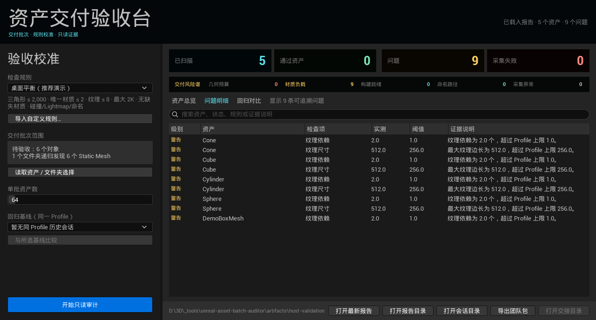

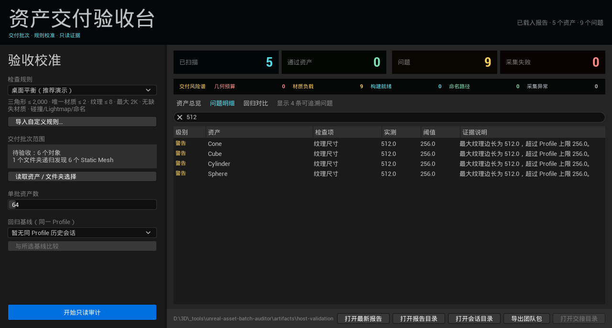

### 只看通过资产

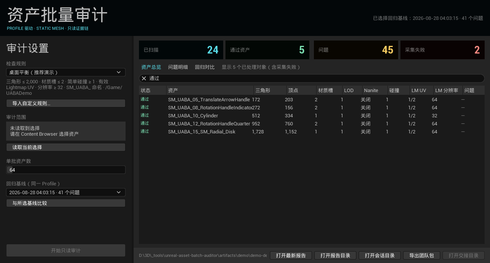

### 只看需处理资产

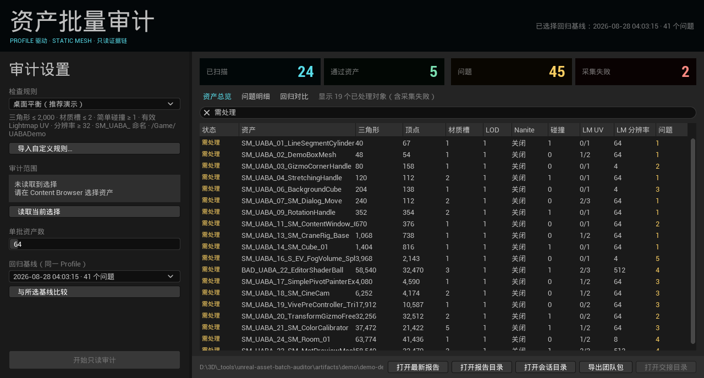

### 简单碰撞证据

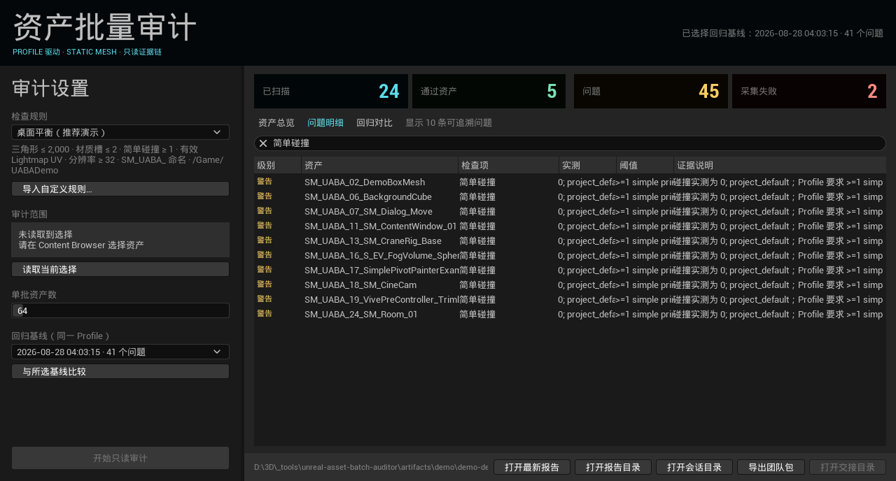

### Lightmap 就绪度证据

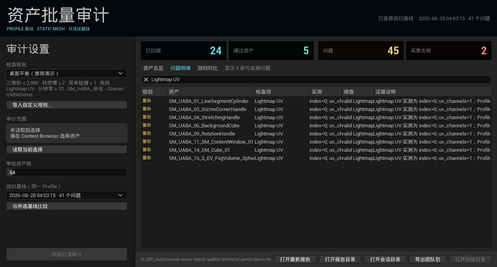

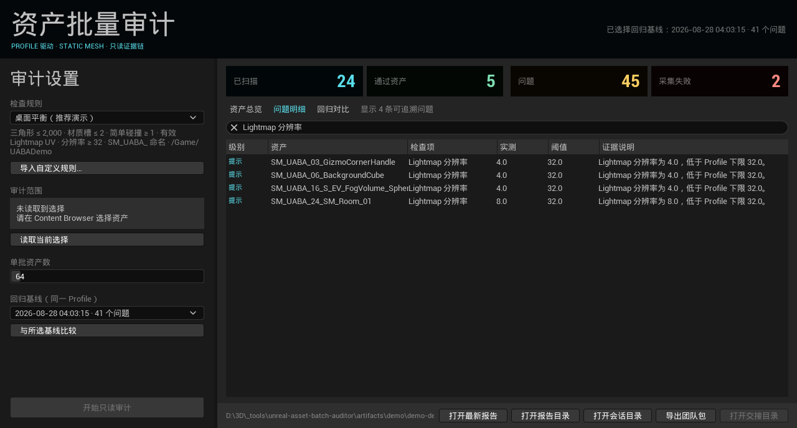

### 命名与目录政策

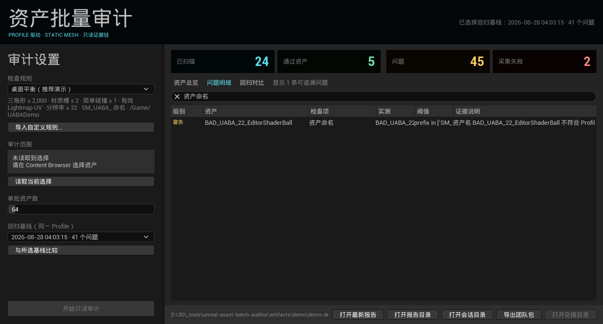


### 修复前后回归对比

每次面板审计都会保留不可变历史报告。选择同一 Profile 的历史会话作为基线后，插件按稳定的
`asset_path + rule_id` 标识展示新增、持续、已解决问题，并独立跟踪采集失败变化。

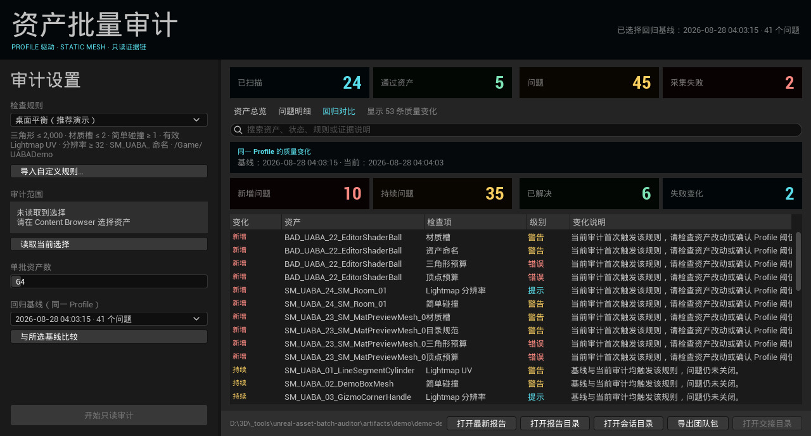

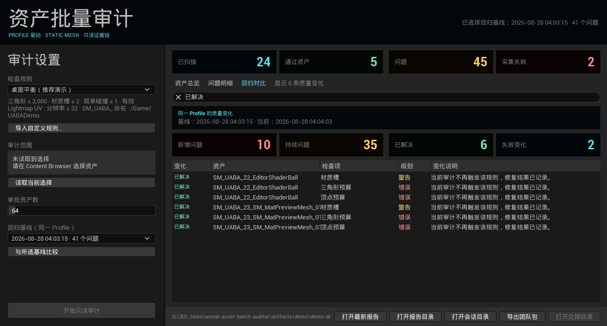

### 可观察批处理与安全取消

面板每个 Editor Tick 最多推进一个采集批次，明确显示当前阶段、对象进度和已完成批次数。用户可提交
“批次间取消”：当前 C++ 批次完成后停止，已经采集的资产和失败证据会写入合法的部分 Report；该会话
不会被误用作后续回归基线。

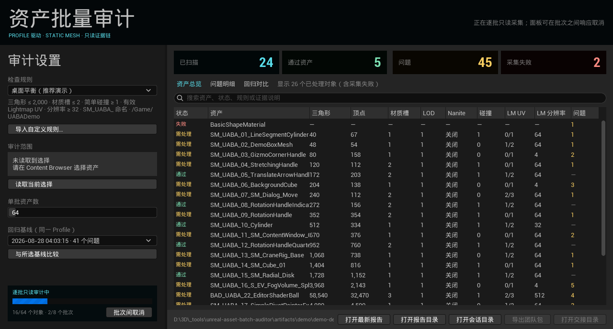

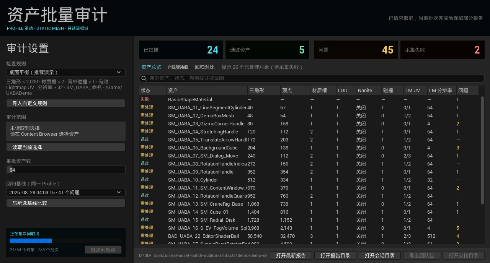

### 一键生成团队交接包

“导出团队包”只读取正式 Report，不重新扫描资产。每次导出生成可离线打开的中文 HTML、UTF-8 BOM
CSV 和带 SHA-256 的交接清单；制片、主美或外包同事无需安装 Unreal，也能看到项目规则、宿主版本、
问题、实测/期望证据、采集失败与验证边界。

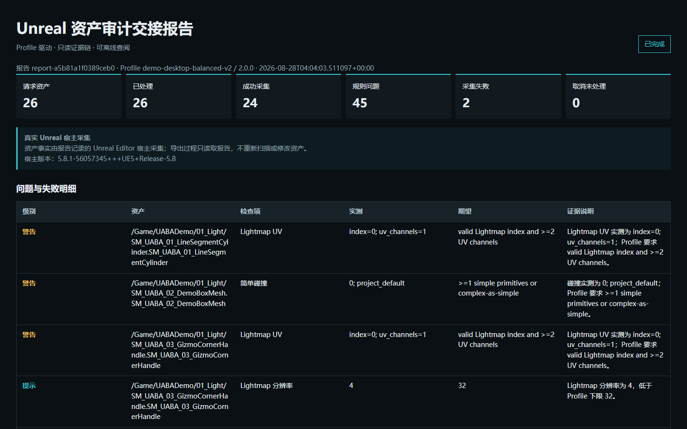

## 当前已实现

- 版本化 JSON `Profile`、`Issue`、`Evidence`、`Report` 合同；
- LOD0 三角形预算、LOD0 顶点预算、材质槽上限、LOD 数量下限、Nanite 预期状态；
- 简单碰撞体数量与碰撞复杂度政策，可由 Profile 决定是否接受 `Complex As Simple`；
- 缺失材质槽、唯一有效材质数、已加载纹理依赖数与最大纹理尺寸政策；
- Lightmap UV 有效性与最少 UV 通道数、Lightmap 最低分辨率；
- 可选资产名前缀、完整正则、允许项目根目录与禁用目录段；旧 v2 Profile 不配置时保持兼容；
- 每条 Evidence 记录观测值、Profile 期望值及其 JSON Pointer；
- Report 同时保存所有成功资产的采集元数据，因此通过项也可与 Editor 复核；
- Unreal Editor-only 插件和只读 C++ 批量采集接口；
- UE 原生中文 Slate 面板：读取 Content Browser 选择、从预置规则下拉框切换 Profile、运行审计与共享搜索；
- 显式资产与文件夹可以组成同一交付批次；文件夹递归只发现 Static Mesh，结果去重并稳定排序；
- “交付风险谱”按几何预算、材质负载、构建就绪、命名路径和采集异常汇总真实问题，点击即可筛选明细；
- “资产总览”展示每个已采集资产的通过/需处理/失败状态、几何预算、材质/纹理依赖、LOD、Nanite、碰撞、Lightmap UV、Lightmap 分辨率和问题数，不再隐藏通过资产；
- “问题明细”保留严重度、规则、实测值、Profile 阈值与本地化证据说明，并可直接打开最新 JSON 或报告目录；
- 面板运行会在项目 `Saved/UnrealAssetBatchAuditor/Sessions` 中保存不可变历史报告和版本化轻量索引，不再只留下会被覆盖的 `latest-report.json`；
- 中文面板可选择同 Profile 历史会话作为回归基线，查看新增、持续、已解决和采集失败变化；比较结果使用版本化 JSON，可供后续 CI 或团队看板消费；
- 调用方可设置正整数批次大小；进度事件覆盖请求、处理、成功、失败和取消数量；
- 取消仅在 C++ 批次之间生效，已完成批次的资产与失败证据会保留在 Report；
- 原生面板使用版本化任务状态驱动 pending/running/cancelling/completed/cancelled/failed，并在 Editor Tick 之间推进批次；
- 从正式 Report 确定性生成中文单文件 HTML、UTF-8 BOM CSV 和 SHA-256 交接清单，不重新扫描资产；
- Python fixture collector 与 Unreal C++ collector 使用同一编排边界；
- 离线错误资产集、回归测试和显式 `real_unreal_validation=false` 报告。
- 版本化项目预设与 `UnrealEditor-Cmd` 无人值守入口，输出正式 Report、轻量运行摘要和稳定退出码。

示例 Profile 的数值只是格式示例，不代表行业标准。正式项目必须复制并评审自己的 Profile。

## 离线运行

```powershell
python -m venv .venv
.\.venv\Scripts\python.exe -m pip install -e ".[dev]"
.\scripts\validate.ps1 -Tier quick
.\.venv\Scripts\unreal-asset-audit.exe `
  --profile config\Profiles\default-static-mesh-profile.v3.json `
  --fixture tests\fixtures\static_meshes.v3.json `
  --out artifacts\reports\offline-fixture-report.json
```

离线 fixture 只验证合同、规则和报告编排，不能证明插件已经在 Unreal 中编译或运行。

## 无人值守项目门禁

把项目 Profile、显式资产/目录范围、阻断严重度和输出位置写入项目预设，然后运行：

```powershell
.\scripts\run_unattended_audit.ps1 `
  -EngineRoot "C:\Program Files\Epic Games\UE_5.8" `
  -ProjectPath "D:\Project\MyGame.uproject" `
  -PresetPath "D:\Project\Config\AssetAudit\delivery-gate.v1.json"
```

退出码固定为：`0` 通过、`10` 规则阻断、`20` 采集不完整、`30` 配置错误、`40` 宿主运行错误。
工具不会默认扫描整个项目：预设必须显式写出 object path 或允许递归的 `/Game/...` 目录，空范围和
通配符会被拒绝。每轮同时生成完整 Report 与轻量 `latest-run-summary.json`，便于本地脚本或 CI
读取；本仓只证明命令行入口可用，不声称已经接入任何公司的外部 CI。

- [项目预设与无人值守接入教程](docs/UNATTENDED_AUDIT.md)
- [可复制的宿主演示预设](Resources/ProjectPresets/engine-basic-shapes-ci.v1.json)

## 可录制 Demo Kit

仓库内置一个 UE 5.8.1 非生产演示工程和确定性生成脚本。脚本从用户本机已安装的 `/Engine`
内容生成 24 个真实项目 `.uasset`，并建立三种复杂度分组、三套训练 Profile、两个诊断输入、
两轮真实 v3 报告与只读哈希证据。生成器先建立无三类注入故障的基线，再明确构造三个项目自有故障副本：错误命名、放入
`Developers` 目录、移除简单碰撞并把 Lightmap 分辨率降到 8；生成器不会修改 `/Engine` 源资产。

```powershell
.\scripts\prepare_demo.ps1 -EngineRoot "C:\Program Files\Epic Games\UE_5.8"
```

- [完整安装与操作教程](docs/demo/DEMO_SETUP_AND_USE.md)
- [24 个演示资产矩阵](docs/demo/DEMO_ASSET_MATRIX.md)
- [6–8 分钟录屏分镜与讲稿](docs/demo/VIDEO_RECORDING_SCRIPT.md)
- [当前界面与交接报告截图清单](docs/demo/SCREENSHOT_PLAN.md)

Demo Profile 是为了形成清晰对比而模拟的项目数据，不代表行业标准。主要 Editor 交互入口是
`工具 > 资产批量审计`；脚本入口仍保留给自动化、回归测试和进阶演示。

仓库不再分发由 Unreal Engine 内容复制出的 `.uasset` 二进制；`prepare_demo.ps1` 会在本机生成它们。
生成器不会修改 `/Engine` 原始资产。

插件安装包自带三套可直接选择的演示规则：`桌面平衡（推荐演示）`、`移动端严格`、`宽松复核`。
普通用户不需要填写 JSON 路径；“导入自定义规则”只用于项目接入自己的 Profile。

## 安装

### 推荐：直接使用发布包

从 [GitHub Releases](https://github.com/Ubik42/unreal-asset-batch-auditor/releases/tag/v0.8.0)
下载 `UnrealAssetBatchAuditor-0.8.0-UE5.8-Win64.zip`，解压后执行：

```powershell
.\install-plugin.ps1 -Action Install -ProjectPath "<项目目录或 .uproject 路径>"
```

安装器会复制独立插件目录、备份并更新 `.uproject`。升级保留旧插件备份，卸载也可恢复；完整步骤见
[发布包安装说明](docs/RELEASE_INSTALL.md)。

### 从源码编译

1. 把本仓复制或链接到 `<Project>/Plugins/UnrealAssetBatchAuditor`。
2. 在项目 `.uproject` 中启用 `PythonScriptPlugin`，并启用本插件。
3. Python 编排包已位于插件标准目录 `Content/Python`，不需要额外复制或配置搜索路径。
4. 关闭 Editor，重新生成 IDE project files。
5. 用项目所对应的 Unreal Engine 版本构建 `Development Editor` target。
6. 启动 Editor，在 `工具 > 资产批量审计` 打开工作台，再按
   [宿主测试清单](docs/HOST_TEST_PLAN.md)执行真实验证。

插件 descriptor 只声明 `Editor` 模块。C++ collector 仅接收显式 object path，并读取
`UStaticMesh` render data、材质/已加载纹理依赖、Nanite、BodySetup 碰撞聚合体和 Lightmap 设置。当前实现为了获得
顶点/三角形和 UV 通道数据会加载指定网格；没有扫描整个项目，也没有逐顶点 Python 循环。

Editor Python 的便捷入口默认每批 128 个显式 object path，也允许调用方注入取消和进度回调：

```python
from run_asset_audit import run

report = run(
    profile_path="D:/Project/Config/static-mesh-profile.json",
    asset_paths=selected_asset_paths,
    output_path="D:/Project/Saved/Audits/static-mesh-report.json",
    batch_size=64,
)
```

## 验证边界与开发路线

- 当前没有自动修改 Nanite、SavePackage、MarkPackageDirty 或网格 Build API；
- 已在 UE 5.8.1（changelist 56057345）完成 Win64 Development Editor BuildPlugin、命令行真实宿主运行和可见 Static Mesh Editor 复核；
- v0.5 已在独立 UE 5.8.1 宿主实际采集 Cone、Cube、Cylinder、Sphere 的碰撞体、碰撞复杂度、UV 通道、Lightmap 索引与分辨率；4 个源资产扫描前后 SHA-256 不变；
- 扫描前后 Engine BasicShapes 的 9 个 `.uasset` SHA-256 全部不变；证据位于 `artifacts/host-validation/`；
- 已建立 64 个 Engine Static Mesh、2 次预热、7 次重复的真实宿主热缓存基线；结果只用于回归，不外推到生产项目或数千资产；
- 有界分批、进度、批次间取消和部分失败汇总已在真实 UE 5.8.1 宿主验证；完整场景调用尺寸为 `[2,2,1]`，取消场景只执行首批 `[2]`；
- v0.8 发布基线完成历史会话、回归对比、批次间取消、团队包、确定性发布以及全新安装/升级验证；完整证据见 `artifacts/goal/checkpoint-0015.json`；
- v0.9-dev2 已通过 68 项 Python 测试、Ruff 与 UE 5.8.1 BuildPlugin；独立宿主真实采集 5 个 Engine Static Mesh 的有效材质路径、纹理依赖数和最大纹理边长；
- 材质证据宿主以明确标注的模拟 Profile 产生 9 条纹理风险，14 张原生 Slate 图与生命周期记录位于 `docs/images/workflow/v0.9-material/` 和 `artifacts/host-validation/m9/`；这不代表运行时 GPU 成本、完整 Cook 依赖或人工点击测试；
- v0.9-dev3 增加项目预设与稳定退出码；独立 UE 5.8.1 命令行宿主按显式 `/Engine/BasicShapes` 范围审计 6 个资产，生成 12 条非阻断告警、0 个采集失败并以退出码 0 结束；
- 下一阶段只做 v0.9 作品级发布收口，不加入泛 AI 对话或 PCG；
- 不声明 Marketplace 就绪、其他 UE 版本兼容或生产规模绝对无卡顿。

## 许可证与演示素材

源码使用 [MIT License](LICENSE)。仓库不再分发 Unreal Engine 派生 `.uasset`；24 个 Demo 网格由用户本机
已安装的 Engine 内容通过确定性脚本复制到项目专用命名空间，生成器不会修改 `/Engine` 原件。Profile
阈值是用于展示机制的模拟项目数据，不代表行业统一标准。

持续开发状态见 [`config/goal-state.json`](config/goal-state.json)，可恢复的 Codex `/goal` 提示词见
[`docs/development/CODEX_PRODUCTIZATION_GOAL.md`](docs/development/CODEX_PRODUCTIZATION_GOAL.md)，完整路线见
[`docs/DEVELOPMENT_PLAN.md`](docs/DEVELOPMENT_PLAN.md)。
