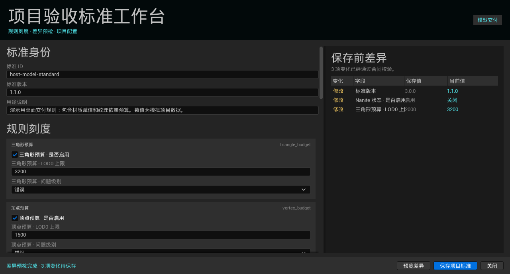
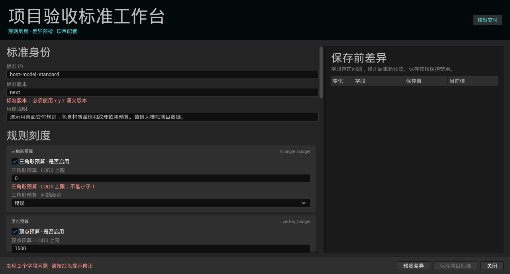
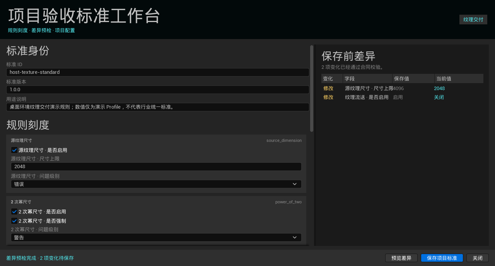

# 项目验收标准

项目验收标准把“团队自己的资产要求”与插件随附的演示模板分开管理。内置模板始终只读；项目标准保存在
当前 Unreal 工程的 `Config/AssetAudit/Profiles`，可以进入版本控制并随项目交付。

## 当前工作流

1. 在“验收校准”中选择模型或纹理轨道；
2. 选择一个内置模板，展开项会标明“内置只读”；
3. 点击“复制为项目标准”；
4. 插件通过 Python 合同层校验源文件，以原子写入方式创建项目副本，并立即选中新标准；
5. 点击“打开标准工作台”，按规则分组调整启停、阈值、严重度、标准 ID、版本和说明；
6. 点击“预览差异”，右侧核对保存值与当前值；字段无误且预览仍有效时才能保存；
7. 保存后项目标准重新进入当前轨道下拉框，后续 Report 记录该标准的 `profile_id` 与
   `profile_version`。

连续复制同一模板不会覆盖已有文件，而会生成稳定的 `-2`、`-3` 后缀。点击“项目标准目录”可直接
打开工程配置位置。“临时导入外部规则”仍保留用于一次性排查，但不会伪装成受项目管理的标准。

## 校验与写入边界

- 只接受当前模型 Profile v3 与纹理 Profile v1；
- 阈值、开关、严重度、状态枚举和压缩/色彩空间组合继续由现有 Python 合同校验；
- 错误返回字段路径与中文说明，Slate 不复制第二套判定逻辑；
- 保存使用同目录临时文件、刷新并原子替换，失败时不破坏旧标准；
- 结构化差异按稳定字段路径比较，不会因 JSON 对象键顺序变化产生假差异；
- 本功能只写项目配置，不修改任何 `.uasset`、内置模板或历史 Report。

字段问题直接出现在对应输入下方，右侧差异区保持空白，保存按钮禁用：

纹理工作台使用独立的纹理 Profile v1 字段，包括尺寸、Mip、Texture Group、Compression/sRGB、
Virtual Texture 和流送：

## 可复制样例

- [PC 环境道具标准](../Demo/ProjectStandards/environment-prop-pc.v3.json)：几何、材质、碰撞、Lightmap、命名和目录；
- [移动端道具纹理标准](../Demo/ProjectStandards/mobile-prop-texture.v1.json)：2K、Mip、Texture Group、色彩空间、VT 和流送。

两份文件均为自行模拟的项目数据，不包含公司资产，也不代表行业统一阈值。

## 宿主验证范围

独立 UE 5.8.1 宿主验证了模型和纹理工作台构建、非法字段、差异预览、原子保存，并让保存后的两份
项目 Profile 分别驱动真实 Engine Static Mesh 与 Texture2D 采集。自动化没有模拟人工鼠标录制，
也不证明任意 Profile Schema、多人配置治理或跨版本兼容。
